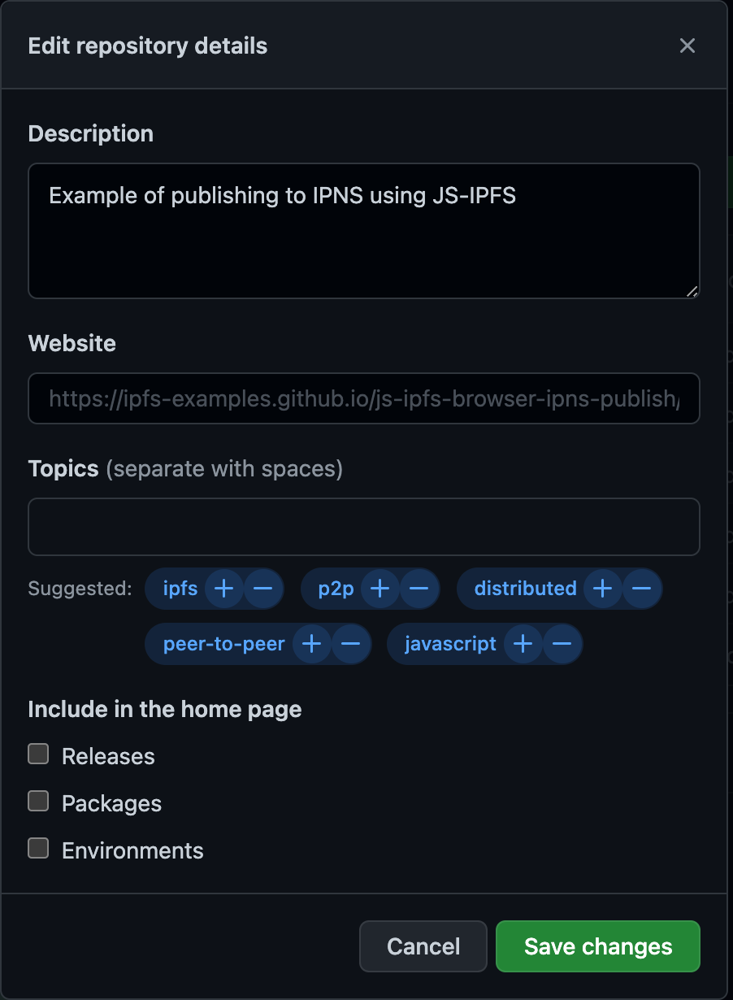

<p align="center">
  <a href="https://js.ipfs.io" title="JS IPFS">
    
  </a>
</p>

<h3 align="center"><b>JS IPFS Examples</b></h3>

<p align="center">
  <b><i>Collection of js-ipfs examples</i></b>
  <br />
  <br />
  
  <br>
  <a href="https://github.com/ipfs/js-ipfs/tree/master/docs">Explore the docs</a>
  ·
  <a href="https://github.com/ipfs-examples/js-ipfs-examples/issues">Report Bug</a>
  ·
  <a href="https://github.com/ipfs-examples/js-ipfs-examples/issues">Request Feature/Example</a>
</p>

## Table of Contents

- [Table of Contents](#table-of-contents)
- [About The Project](#about-the-project)
- [Getting Started](#getting-started)
  - [Prerequisites](#prerequisites)
  - [Installation](#installation)
- [Structure](#structure)
- [IPFS Tutorials at ProtoSchool](#ipfs-tutorials-at-protoschool)
- [Documentation](#documentation)
- [ipfs or ipfs-core?](#ipfs-or-ipfs-core)
- [Contributing](#contributing)
  - [Guidelines](#guidelines)
  - [Steps to follow after adding a new example](#steps-to-follow-after-adding-a-new-example)
    - [Create a repo](#create-a-repo)
    - [Update `js-ipfs` to run tests against the repo](#update-js-ipfs-to-run-tests-against-the-repo)
- [Want to hack on IPFS?](#want-to-hack-on-ipfs)

## About The Project

- Read the [docs](https://github.com/ipfs/js-ipfs/tree/master/docs)
- Look into other [examples](https://github.com/ipfs-examples/js-ipfs-examples) to learn how to spawn an IPFS node in Node.js and in the Browser
- Consult the [Core API docs](https://github.com/ipfs/js-ipfs/tree/master/docs/core-api) to see what you can do with an IPFS node
- Visit https://dweb-primer.ipfs.io to learn about IPFS and the concepts that underpin it
- Head over to https://proto.school to take interactive tutorials that cover core IPFS APIs
- Check out https://docs.ipfs.io for tips, how-tos and more
- See https://blog.ipfs.io for news and more
- Need help? Please ask 'How do I?' questions on https://discuss.ipfs.io

## Getting Started

### Prerequisites

Make sure you have installed all of the following prerequisites on your development machine:

- Git - [Download & Install Git](https://git-scm.com/downloads). OSX and Linux machines typically have this already installed.
- Node.js - [Download & Install Node.js](https://nodejs.org/en/download/) and the npm package manager.

### Installation

1. Install yarn globally (needed to resolve dependencies correctly when working in a monorepo)
   ```sh
   npm install -g yarn
   ```
2. Install NPM packages
   ```sh
   yarn install
   ```
3. Run all the examples
   ```sh
   yarn run test
   ```

## Structure

This project is broken into 2 modules, their purposes are:

- [`/examples/*`](./examples) Examples of IPFS implementations with bundlers, frameworks, tutorials among others
- [`/lib/test-util-ipfs-example`](./lib/test-util-ipfs-example) Collection of helpers to orchestrate the tests for the examples

## IPFS Tutorials at ProtoSchool

Explore [ProtoSchool's IPFS tutorials](https://proto.school/#/tutorials?course=ipfs) for interactive js-ipfs coding challenges, deep dives into DWeb concepts like content addressing, and more.

## Documentation

- [Config](https://docs.ipfs.io/)
- [Core API](https://github.com/ipfs/js-ipfs/tree/master/docs/core-api)
- [Examples](https://github.com/ipfs-examples/js-ipfs-examples)
- [Development](https://github.com/ipfs/js-ipfs/blob/master/docs/DEVELOPMENT.md)
- [Tutorials](https://proto.school)

## ipfs or ipfs-core?

The JavaScript implementation of IPFS is available as two packages, `ipfs-core` and `ipfs`.

`ipfs-core` contains the [core api](https://github.com/ipfs/js-ipfs/tree/master/docs/core-api) and is intended to be used to run an IPFS node as part of your application without the need to start external processes or manage API ports and servers.

`ipfs` is built on `ipfs-core` but also includes the CLI, an HTTP RPC API server and other tools to run `ipfs` as a background process so is a larger install with more dependencies.

If you are writing an application that needs to access the IPFS network, use `ipfs-core`.  If you wish to use js-IPFS in a terminal window or run it as a server for use by multiple otherwise unrelated processes, use `ipfs`.

## Contributing

Contributions are what make the open source community such an amazing place to be learn, inspire, and create. Any contributions you make are **greatly appreciated**.

1. Fork the IPFS Examples Project (`https://github.com/ipfs-examples/js-ipfs-examples`)
2. Create your Feature Branch (`git checkout -b feature/amazing-feature`)
3. Commit your Changes (`git commit -a -m 'feat: add some amazing feature'`)
4. Push to the Branch (`git push origin feature/amazing-feature`)
5. Open a Pull Request

### Guidelines

- Follow the [example-template](`https://github.com/ipfs-examples/example-template`)
  - This repository serves as template to create new examples to guarantee consistency between examples. It contains all the necessary files to create a new example

- Follow the [example-template-fork-&-go](`https://github.com/ipfs-examples/example-fork-go-template`)
  - This repository serves as template to be used as a reference of how to implement the CI in order to sync the example with a standalone repo (correspondent to each example)

- Examples must:
  - Live inside the `/examples/` folder
  - Have tests and should make use of `test-util-ipfs-example` library
    - If possible use `playwright` as test framework
  - Implement the following scripts:
    - `clean`: used to clean all the unnecessary code (e.g.: files generated by bundlers and package managers)
    - `build`: used to build the example
    - `start`: used to start the example
    - `test`: used to test the example

- README must have (see example inside `example-template`):
  - Link to `Codesandbox.com` for one-click running demonstration
  - References for documentation/tutorials used to build the example
  - _Optional:_ Screenshots, gifs, etc... under `img/` folder

- Update the CI to run the tests of the new example as standalone
  - Edit `github/workflows/ci.yml`
  - Add the test name to `project` under `matrix`

- Extend the `test-util-ipfs-example` library if needed to reuse code in other examples

### Steps to follow after adding a new example

#### Create a repo

- Create a new repository based on (https://github.com/ipfs-examples/example-fork-go-template) following the name: `js-ipfs-{EXAMPLE_NAME}` with a description

- Turn off issue/wikis/projects/discussions

<p align="center">
  
</p>

- Disable Releases/Environments/Packages

<p align="center">
  
</p>

- Follow the instruction inside the README

#### Update `js-ipfs` to run tests against the repo

Open a PR to the [ipfs/js-ipfs](https://github.com/ipfs/js-ipfs) project that edits the `.github/workflows/test.yml` in order to make sure a js-ipfs release does not break your new example.

Search `.github/workflows/test.yml` for the `test-examples` section and add a block at the end of the `example` matrix key similar to:

```yml
- name: my super fun new example
  repo: https://github.com/ipfs-examples/js-ipfs-my-super-fun-new-example.git
  deps: ipfs-core@$PWD/packages/ipfs-core/dist,ipfs-http-client@$PWD/packages/ipfs-http-client/dist
```

The value of the `deps` key will vary depending on which modules from js-ipfs your example uses. Above we override the `ipfs-core` and `ipfs-http-client` modules, but your example may different deps.

Please see the existing setup in `.github/workflows/test.yml` for how to ensure you are overriding the correct modules.

## Want to hack on IPFS?

[](https://github.com/ipfs/community/blob/master/CONTRIBUTING.md)

The IPFS implementation in JavaScript needs your help! There are a few things you can do right now to help out:

Read the [Code of Conduct](https://github.com/ipfs/community/blob/master/code-of-conduct.md) and [JavaScript Contributing Guidelines](https://github.com/ipfs/community/blob/master/CONTRIBUTING_JS.md).

- **Check out existing issues** The [issue list](https://github.com/ipfs/js-ipfs/issues) has many that are marked as ['help wanted'](https://github.com/ipfs/js-ipfs/issues?q=is%3Aissue+is%3Aopen+sort%3Aupdated-desc+label%3A%22help+wanted%22) or ['difficulty:easy'](https://github.com/ipfs/js-ipfs/issues?q=is%3Aissue+is%3Aopen+sort%3Aupdated-desc+label%3Adifficulty%3Aeasy) which make great starting points for development, many of which can be tackled with no prior IPFS knowledge
- **Look at the [IPFS Roadmap](https://github.com/ipfs/roadmap)** This are the high priority items being worked on right now
- **Perform code reviews** More eyes will help
  a. speed the project along
  b. ensure quality, and
  c. reduce possible future bugs.
- **Add tests**. There can never be enough tests.
- **Join the [Weekly Core Implementations Call](https://github.com/ipfs/team-mgmt/issues/992)** it's where everyone discusses what's going on with IPFS and what's next
