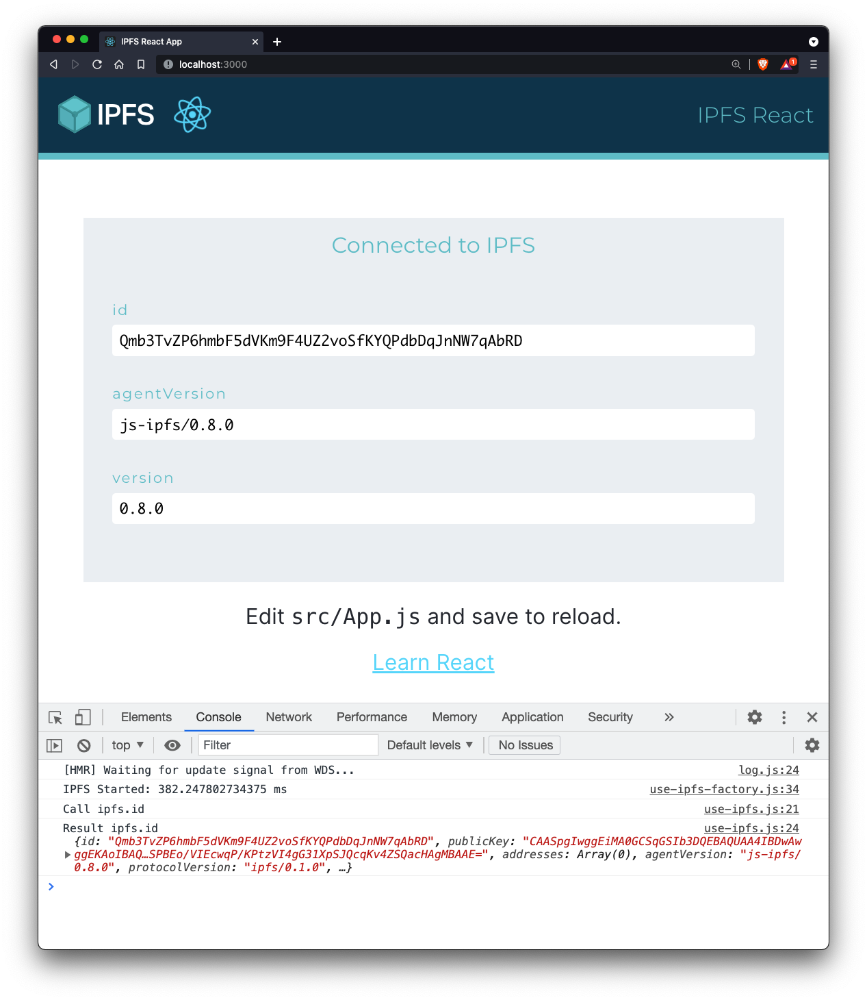

<p align="center">
  <a href="https://js.ipfs.io" title="JS IPFS">
    
  </a>
</p>

<h3 align="center"><b>IPFS React App</b></h3>

<p align="center">
  <b><i>Using js-ipfs in a `create-react-app`</i></b>
  <br />
  <br />
  
  <br>
  <a href="https://github.com/ipfs/js-ipfs/tree/master/docs">Explore the docs</a>
  ·
  <a href="https://codesandbox.io/">View Demo</a>
  ·
  <a href="https://github.com/ipfs-examples/js-ipfs-examples/issues">Report Bug</a>
  ·
  <a href="https://github.com/ipfs-examples/js-ipfs-examples/issues">Request Feature/Example</a>
</p>

## Table of Contents

- [Table of Contents](#table-of-contents)
- [About The Project](#about-the-project)
- [Getting Started](#getting-started)
  - [Pre requisites](#pre-requisites)
  - [Installation and Running example](#installation-and-running-example)
  - [Available Scripts from create-react-app](#available-scripts-from-create-react-app)
    - [`npm start`](#npm-start)
    - [`npm test`](#npm-test)
    - [`npm run build`](#npm-run-build)
- [Usage](#usage)
- [References](#references)
- [Documentation](#documentation)
- [Contributing](#contributing)
- [Want to hack on IPFS?](#want-to-hack-on-ipfs)

## About The Project

- Read the [docs](https://github.com/ipfs/js-ipfs/tree/master/docs)
- Look into other [examples](https://github.com/ipfs-examples/js-ipfs-examples) to learn how to spawn an IPFS node in Node.js and in the Browser
- Consult the [Core API docs](https://github.com/ipfs/js-ipfs/tree/master/docs/core-api) to see what you can do with an IPFS node
- Visit https://dweb-primer.ipfs.io to learn about IPFS and the concepts that underpin it
- Head over to https://proto.school to take interactive tutorials that cover core IPFS APIs
- Check out https://docs.ipfs.io for tips, how-tos and more
- See https://blog.ipfs.io for news and more
- Need help? Please ask 'How do I?' questions on https://discuss.ipfs.io

## Getting Started

### Pre requisites

Make sure you have installed all of the following prerequisites on your development machine:

- Git - [Download & Install Git](https://git-scm.com/downloads). OSX and Linux machines typically have this already installed.
- Node.js - [Download & Install Node.js](https://nodejs.org/en/download/) and the npm package manager.

### Installation and Running example

```console
> npm install
> npm start
```

Now open your browser at `http://localhost:3000`

### Available Scripts from create-react-app

In the project directory, you can run:

#### `npm start`

Runs the app in the development mode.<br>
Open [http://localhost:3000](http://localhost:3000) to view it in the browser.

The page will reload if you make edits.<br>
You will also see any lint errors in the console.

#### `npm test`

Launches the test runner in the interactive watch mode.<br>
See the section about [running tests](https://facebook.github.io/create-react-app/docs/running-tests) for more information.

#### `npm run build`

Builds the app for production to the `build` folder.<br>
It correctly bundles React in production mode and optimizes the build for the best performance.

The build is minified and the filenames include the hashes.<br>
Your app is ready to be deployed! Read how to host a [single page](https://docs.ipfs.io/how-to/websites-on-ipfs/single-page-website/) or an [entire website](https://docs.ipfs.io/how-to/websites-on-ipfs/multipage-website/#prerequisites) on IPFS.

But with modern hosting services like Heroku, Netlity or Fleek, you can skip the build because they will do a complete github deployment for you. See the React official page about [deployment](https://facebook.github.io/create-react-app/docs/deployment) for more information.

## Usage

This is a minimal demonstration of how to use `js-ipfs` in a `create-react-app` generated app.

It boots up a `js-ipfs` instance (an IPFS node) via a custom React hook in `./src/hooks/use-ipfs-factory.js`, which is called from `./src/App.js`. Once the IPFS node is set up, `./src/App.js` displays the [PeerId](https://docs.libp2p.io/concepts/peer-id/) of this node and the version number of `js-ipfs` used to spawn it.

All React applications store their main logic in `App.js`:

- `App.js` renders the cosmetics of the demo and calls `useIpfs` to retrieve the `id` of the node
- `useIpfsFactory.js` initialises and closes the IPFS local node
- `useIpfs.js` does the actual calls to IPFS to retrieve the property specified in argument (here the retrieved property is `id`, requested from `App.js`)

Once the IPFS node is set up, `App.js` displays its ident and its version number.

> _Side note: The PeerId of the IPFS node is [the multihash of the public key of this node](https://github.com/libp2p/specs/blob/master/peer-ids/peer-ids.md#peer-ids). The public-private key pair of a node is generated by typing `ipfs init`._



**Note**: this example is useful to learn how to spawn IPFS from a web page. It is also possible to [spawn an IPFS daemon from the command line](https://docs.ipfs.io/install/command-line/) with `ipfs daemon`. While self-hosting is advised, one can also delegate IPFS operations to a third-party like Infura. See tutorials [here](https://blog.infura.io/part-2-getting-started-with-ipfs-on-infura/) and [here](https://blog.infura.io/part-2-getting-started-with-ipfs-on-infura/).

_For more examples, please refer to the [Documentation](#documentation)_

## References

- Documentation:
  - [IPFS CONFIG](https://github.com/ipfs/js-ipfs/blob/master/docs/CONFIG.md)
  - [MISCELLANEOUS](https://github.com/ipfs/js-ipfs/blob/master/docs/core-api/MISCELLANEOUS.md)

## Documentation

- [Config](https://docs.ipfs.io/)
- [Core API](https://github.com/ipfs/js-ipfs/tree/master/docs/core-api)
- [Examples](https://github.com/ipfs-examples/js-ipfs-examples)
- [Development](https://github.com/ipfs/js-ipfs/blob/master/docs/DEVELOPMENT.md)
- [Tutorials](https://proto.school)

## Contributing

Contributions are what make the open source community such an amazing place to be learn, inspire, and create. Any contributions you make are **greatly appreciated**.

1. Fork the IPFS Project
2. Create your Feature Branch (`git checkout -b feature/amazing-feature`)
3. Commit your Changes (`git commit -a -m 'feat: add some amazing feature'`)
4. Push to the Branch (`git push origin feature/amazing-feature`)
5. Open a Pull Request

## Want to hack on IPFS?

[](https://github.com/ipfs/community/blob/master/CONTRIBUTING.md)

The IPFS implementation in JavaScript needs your help! There are a few things you can do right now to help out:

Read the [Code of Conduct](https://github.com/ipfs/community/blob/master/code-of-conduct.md) and [JavaScript Contributing Guidelines](https://github.com/ipfs/community/blob/master/CONTRIBUTING_JS.md).

- **Check out existing issues** The [issue list](https://github.com/ipfs/js-ipfs/issues) has many that are marked as ['help wanted'](https://github.com/ipfs/js-ipfs/issues?q=is%3Aissue+is%3Aopen+sort%3Aupdated-desc+label%3A%22help+wanted%22) or ['difficulty:easy'](https://github.com/ipfs/js-ipfs/issues?q=is%3Aissue+is%3Aopen+sort%3Aupdated-desc+label%3Adifficulty%3Aeasy) which make great starting points for development, many of which can be tackled with no prior IPFS knowledge
- **Look at the [IPFS Roadmap](https://github.com/ipfs/roadmap)** This are the high priority items being worked on right now
- **Perform code reviews** More eyes will help
  a. speed the project along
  b. ensure quality, and
  c. reduce possible future bugs.
- **Add tests**. There can never be enough tests.
- **Join the [Weekly Core Implementations Call](https://github.com/ipfs/team-mgmt/issues/992)** it's where everyone discusses what's going on with IPFS and what's next
