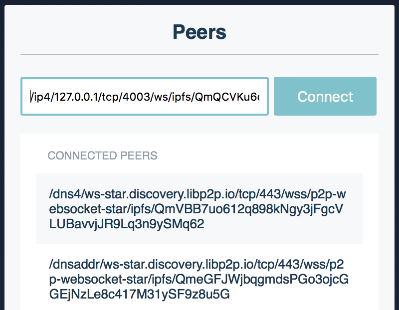

<p align="center">
  <a href="https://js.ipfs.io" title="JS IPFS">
    
  </a>
</p>

<h3 align="center"><b>Exchange files with js-ipfs</b></h3>

<p align="center">
  <b><i>Exchange files between the browser and other IPFS nodes</i></b>
  <br />
  <br />
  
  <br>
  <a href="https://github.com/ipfs/js-ipfs/tree/master/docs">Explore the docs</a>
  ·
  <a href="https://codesandbox.io/">View Demo</a>
  ·
  <a href="https://github.com/ipfs-examples/js-ipfs-examples/issues">Report Bug</a>
  ·
  <a href="https://github.com/ipfs-examples/js-ipfs-examples/issues">Request Feature/Example</a>
</p>

## Table of Contents

- [Table of Contents](#table-of-contents)
- [About The Project](#about-the-project)
- [Getting Started](#getting-started)
  - [Pre requisites](#pre-requisites)
  - [Installation and Running example](#installation-and-running-example)
- [Usage](#usage)
  - [Step-by-step instructions](#step-by-step-instructions)
  - [1. Install `go-ipfs` or `js-ipfs`](#1-install-go-ipfs-or-js-ipfs)
  - [2. Make your daemons listen on WebSockets](#2-make-your-daemons-listen-on-websockets)
  - [3. Start the app](#3-start-the-app)
  - [4. Dial to a node using WebSockets (your desktop ones)](#4-dial-to-a-node-using-websockets-your-desktop-ones)
  - [5. Transfer files between all of your nodes!](#5-transfer-files-between-all-of-your-nodes)
- [Going to production?](#going-to-production)
  - [Use your own `libp2p-webrtc-star` signaling server](#use-your-own-libp2p-webrtc-star-signaling-server)
- [Documentation](#documentation)
- [Contributing](#contributing)
- [Want to hack on IPFS?](#want-to-hack-on-ipfs)

## About The Project

- Read the [docs](https://github.com/ipfs/js-ipfs/tree/master/docs)
- Look into other [examples](https://github.com/ipfs-examples/js-ipfs-examples) to learn how to spawn an IPFS node in Node.js and in the Browser
- Consult the [Core API docs](https://github.com/ipfs/js-ipfs/tree/master/docs/core-api) to see what you can do with an IPFS node
- Visit https://dweb-primer.ipfs.io to learn about IPFS and the concepts that underpin it
- Head over to https://proto.school to take interactive tutorials that cover core IPFS APIs
- Check out https://docs.ipfs.io for tips, how-tos and more
- See https://blog.ipfs.io for news and more
- Need help? Please ask 'How do I?' questions on https://discuss.ipfs.io

## Getting Started

### Pre requisites

Make sure you have installed all of the following prerequisites on your development machine:

- Git - [Download & Install Git](https://git-scm.com/downloads). OSX and Linux machines typically have this already installed.
- Node.js - [Download & Install Node.js](https://nodejs.org/en/download/) and the npm package manager.
- IPFS Daemon - [Install js-ipfs](https://github.com/ipfs/js-ipfs) or [Download & Install IPFS Desktop](https://docs.ipfs.io/install/ipfs-desktop/) that will run the go version of IPFS or head over to https://dist.ipfs.io/#go-ipfs and hit the "Download go-ipfs" button. Extract the archive and read the instructions to install.

### Installation and Running example

```console
> npm install
> npm start
```

Now open your browser at `http://localhost:8888`

## Usage

This tutorial will help you exchange files between browser nodes and go-ipfs or js-ipfs nodes!

**Note:** As `js-ipfs@0.41.x` currently doesn't support DHT peer discovery, the peer from which you are fetching data should be within the reach (local or in public IP) of the browser node.

That being said, we will explain how to circumvent these caveats and once they are fixed, we'll update the tutorial as well.

The goal of this tutorial is to create a simple application with an IPFS node that dials to other instances using WebRTC, and at the same time dial and transfer files from a browser IPFS node using WebSockets as the transport.

```
┌──────────────┐                ┌──────────────┐
│   Browser    │ libp2p(WebRTC) │   Browser    │
│              │◀──────────────▶│              │
└──────────────┘                └──────────────┘
       ▲                                  ▲
       │WebSockets              WebSockets│
       │        ┌──────────────┐          │
       │        │   Desktop    │          │
       └───────▶│   Terminal   │◀─────────┘
                └──────────────┘
```

### Step-by-step instructions

Here's what we are going to be doing:

1. Install a `go-ipfs` or `js-ipfs` node in your machine
2. Make your daemons listen on WebSockets
3. Start a `libp2p-webrtc-star` signaling server
4. Start the app
5. Dial to a node using WebSockets (your desktop ones)
6. Transfer files between all of your nodes!

Just follow the instructions below and it will be up and running in no time! At the end of this tutorial you should have something like this:


### 1. Install `go-ipfs` or `js-ipfs`

If you already have `go-ipfs` or `js-ipfs` installed in your machine, you can skip this step. Otherwise, read on.

This tutorial works with either `go-ipfs` or `js-ipfs`, so you can install one of your choosing.

`go-ipfs` can be installed via its binary [here](https://ipfs.io/ipns/dist.ipfs.io/#go-ipfs). Alternatively, you can follow the install instructions in [ipfs/go-ipfs](https://github.com/ipfs/go-ipfs#install).

`js-ipfs` requires you to have [node and npm](https://www.npmjs.com/get-npm) installed. Then, you simply run:

```sh
> npm install --global ipfs
```

This will alias `jsipfs` on your machine; this is to avoid issues with `go-ipfs` being called `ipfs`.

At this point, you should have either `js-ipfs` or `go-ipfs` running. Now, initialize it:

```sh
> ipfs init
# or
> jsipfs init
```

This will set up an IPFS repo in your home directory.

### 2. Make your daemons listen on WebSockets

Now you need to edit your `config` file, the one you just set up with `{js}ipfs init`. It should be in either `~/.jsipfs/config` or `~/.ipfs/config`, depending on whether you're using JS or Go.

**Note:** `js-ipfs` sets up a websocket listener by default, so if you're using the JS implementation you can skip this and just start the daemon.

Since websockets support is currently not on by default, you'll need to add a WebSockets address manually. Look into your config file to find the `Addresses` section:

```json
"Addresses": {
  "Swarm": [
    "/ip4/0.0.0.0/tcp/4002"
  ],
  "API": "/ip4/127.0.0.1/tcp/5002",
  "Gateway": "/ip4/127.0.0.1/tcp/9090"
}
```

Add the `/ip4/127.0.0.1/tcp/4003/ws` entry to your `Swarm` array. Now it should look like this:

```json
"Addresses": {
  "Swarm": [
    "/ip4/0.0.0.0/tcp/4002",
    "/ip4/127.0.0.1/tcp/4003/ws"
  ],
  "API": "/ip4/127.0.0.1/tcp/5002",
  "Gateway": "/ip4/127.0.0.1/tcp/9090"
}
```

Save the file and it should be able to listen on Websockets. We're ready to start the daemon.

```sh
> ipfs daemon
# or
> jsipfs daemon
```

You should see the Websocket address in the output:

```sh
Initializing daemon...
Swarm listening on /ip4/127.0.0.1/tcp/4001
Swarm listening on /ip4/127.0.0.1/tcp/4003/ws
Swarm listening on /ip4/192.168.10.38/tcp/4001
Swarm listening on /ip4/192.168.10.38/tcp/4003/ws
API server listening on /ip4/127.0.0.1/tcp/5001
Gateway (readonly) server listening on /ip4/0.0.0.0/tcp/8080
Daemon is ready
```

Check the `/ws` in line 5, that means it is listening. Cool.

### 3. Start the app

We'll need to bundle the dependencies to run the app. Let's do it:

```sh
> npm run build
...
> npm start
```

Now go to http://127.0.0.1:8888 in a modern browser and you're on!

### 4. Dial to a node using WebSockets (your desktop ones)

Make sure you have a daemon running. If you don't, run:

```sh
> ipfs daemon
# or
> jsipfs daemon
```

Open another terminal window to find the websocket addresses that it is listening on:

```sh
> ipfs id
# or
> jsipfs id
```

It should look like this: `/ip4/127.0.0.1/tcp/4003/ws/ipfs/<your_peer_id>`.

Copy and paste the _multiaddr_ to connect to that peer:



Check that you got connected:


> It only works on localhost environments because of a restriction with WebCrypto where it will not load in a page unless that page is loaded over https, or the page is served from localhost: [libp2p/js-libp2p-crypto#105][js-libp2p-crypto#105]

[js-libp2p-crypto#105]: https://github.com/libp2p/js-libp2p-crypto/issues/105

### 5. Transfer files between all of your nodes!

Now you can add files through the CLI with:

```sh
> ipfs add <file>
# or
> jsipfs add <file>
```

Copy and paste the _multihash_ and fetch the file in the browser!


You can also open two browser tabs, drag and drop files in one of them, and fetch them in the other!

But the coolest thing about this tutorial is `pubsub`! You can open two tabs that will share files through workspaces named after the url. Try opening two tabs with the following url:

```
http://127.0.0.1:12345/#file-exchange
# You can substitute `file-exchange` with anything you like, just make sure the two tabs are in the same workspace.
```

Now every file that you upload in one tab will appear in the other! You can even open a new tab in that workspace and it will sync the files that were added before!


_For more examples, please refer to the [Documentation](#documentation)_

## Going to production?

This example uses public webrtc-star servers. These servers should be used for experimenting and demos, they **MUST** not be used in production as there is no guarantee on availability.

### Use your own `libp2p-webrtc-star` signaling server

This server allows the two browser nodes to talk to each other by doing the initial handshake and network introductions.

First install the `libp2p-webrtc-star` module globally:

```sh
> npm install -g libp2p-webrtc-star
```

This will give you the `webrtc-star` command. Use this to start a signaling server:

```sh
> webrtc-star
```

By default it will listen to all incoming connections on port 13579. Override this with the `--host` and/or `--port` options. That is, the following multiaddr: `/ip4/127.0.0.1/tcp/13579/wss/p2p-webrtc-star`.

You should add your signaling server in the IPFS config swarm addresses, so that you listen for new connections through it.

## Documentation

- [Config](https://docs.ipfs.io/)
- [Core API](https://github.com/ipfs/js-ipfs/tree/master/docs/core-api)
- [Examples](https://github.com/ipfs-examples/js-ipfs-examples)
- [Development](https://github.com/ipfs/js-ipfs/blob/master/docs/DEVELOPMENT.md)
- [Tutorials](https://proto.school)

## Contributing

Contributions are what make the open source community such an amazing place to be learn, inspire, and create. Any contributions you make are **greatly appreciated**.

1. Fork the IPFS Project
2. Create your Feature Branch (`git checkout -b feature/amazing-feature`)
3. Commit your Changes (`git commit -a -m 'feat: add some amazing feature'`)
4. Push to the Branch (`git push origin feature/amazing-feature`)
5. Open a Pull Request

## Want to hack on IPFS?

[](https://github.com/ipfs/community/blob/master/CONTRIBUTING.md)

The IPFS implementation in JavaScript needs your help! There are a few things you can do right now to help out:

Read the [Code of Conduct](https://github.com/ipfs/community/blob/master/code-of-conduct.md) and [JavaScript Contributing Guidelines](https://github.com/ipfs/community/blob/master/CONTRIBUTING_JS.md).

- **Check out existing issues** The [issue list](https://github.com/ipfs/js-ipfs/issues) has many that are marked as ['help wanted'](https://github.com/ipfs/js-ipfs/issues?q=is%3Aissue+is%3Aopen+sort%3Aupdated-desc+label%3A%22help+wanted%22) or ['difficulty:easy'](https://github.com/ipfs/js-ipfs/issues?q=is%3Aissue+is%3Aopen+sort%3Aupdated-desc+label%3Adifficulty%3Aeasy) which make great starting points for development, many of which can be tackled with no prior IPFS knowledge
- **Look at the [IPFS Roadmap](https://github.com/ipfs/roadmap)** This are the high priority items being worked on right now
- **Perform code reviews** More eyes will help
  a. speed the project along
  b. ensure quality, and
  c. reduce possible future bugs.
- **Add tests**. There can never be enough tests.
- **Join the [Weekly Core Implementations Call](https://github.com/ipfs/team-mgmt/issues/992)** it's where everyone discusses what's going on with IPFS and what's next
