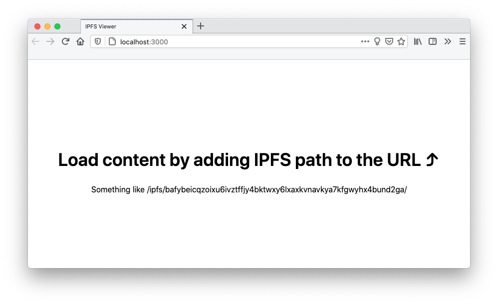
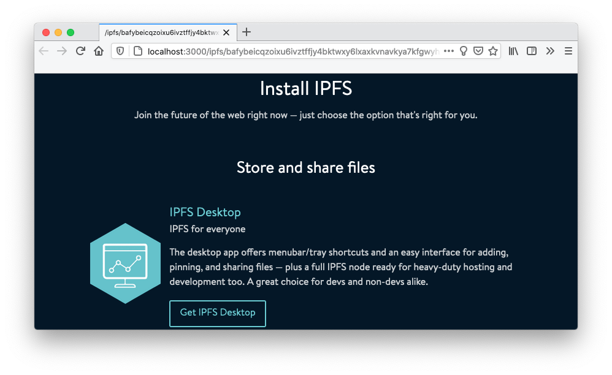

<p align="center">
  <a href="https://js.ipfs.io" title="JS IPFS">
    
  </a>
</p>

<h3 align="center"><b>js-ipfs node using web workers</b></h3>

<p align="center">
  <b><i>Using js-ipfs node in [SharedWorker][] from [ServiceWorker][]</i></b>
  <br />
  <br />
  
  <br>
  <a href="https://github.com/ipfs/js-ipfs/tree/master/docs">Explore the docs</a>
  ·
  <a href="https://codesandbox.io/">View Demo</a>
  ·
  <a href="https://github.com/ipfs-examples/js-ipfs-examples/issues">Report Bug</a>
  ·
  <a href="https://github.com/ipfs-examples/js-ipfs-examples/issues">Request Feature/Example</a>
</p>

## Table of Contents

- [Table of Contents](#table-of-contents)
- [About The Project](#about-the-project)
- [Getting Started](#getting-started)
  - [Prerequisites](#prerequisites)
  - [Installation and Running example](#installation-and-running-example)
- [Usage](#usage)
  - [General Overview](#general-overview)
    - [`src/main.js`](#srcmainjs)
    - [`src/worker.js`](#srcworkerjs)
    - [`src/service.js`](#srcservicejs)
  - [Running example](#running-example)
- [Documentation](#documentation)
- [Contributing](#contributing)
- [Want to hack on IPFS?](#want-to-hack-on-ipfs)

## About The Project

- Read the [docs](https://github.com/ipfs/js-ipfs/tree/master/docs)
- Look into other [examples](https://github.com/ipfs-examples/js-ipfs-examples) to learn how to spawn an IPFS node in Node.js and in the Browser
- Consult the [Core API docs](https://github.com/ipfs/js-ipfs/tree/master/docs/core-api) to see what you can do with an IPFS node
- Visit https://dweb-primer.ipfs.io to learn about IPFS and the concepts that underpin it
- Head over to https://proto.school to take interactive tutorials that cover core IPFS APIs
- Check out https://docs.ipfs.io for tips, how-tos and more
- See https://blog.ipfs.io for news and more
- Need help? Please ask 'How do I?' questions on https://discuss.ipfs.io

## Getting Started

### Prerequisites

Make sure you have installed all of the following prerequisites on your development machine:

- Git - [Download & Install Git](https://git-scm.com/downloads). OSX and Linux machines typically have this already installed.
- Node.js - [Download & Install Node.js](https://nodejs.org/en/download/) and the npm package manager.

### Installation and Running example

```console
> npm install
> npm start
```

Now open your browser at `http://localhost:3000`

## Usage

> In this example, you will find boilerplate code you can use to set up an IPFS
> node in a [SharedWorker][] and use it from a [ServiceWorker][].

### General Overview

#### `src/main.js`

Module is loaded in the main thread (DOM window) and is responsible for wiring
all the pieces together:

1. Activates a [SharedWorker][] that runs an IPFS node.
2. Registers a [ServiceWorker][] to serve IPFS content from.
3. Listens to [MessagePort][] requests from the [ServiceWorker][] and responds
   back with a [MessagePort][] of the [SharedWorker][], enabling
   it to interact with shaerd IPFS node.

#### `src/worker.js`

Module is loaded in the [SharedWorker][]. It demonstrates how to setup the IPFS
node such that it can be used in other browsing contexts.

#### `src/service.js`

Module is loaded in the [ServiceWorker][] and responds to all the requests from
the page. It recognizes four different request routes:

1. Routes `/ipfs/...`, `/ipns/...` are served html pages that:

  - Contain a full page iframe that has an `src` derived from request path e.g.:

   ```
   /ipfs/Qm...hash/file/name -> /view/Qm...hash/file/name
   ```
  - `src/main.js` script loaded in it.

  This way when request from `/view/Qm..hash/file/name` arrives [ServiceWorker][]
  can obtain a [MessagePort][] for the [SharedWorker][] by requesting it from
  the iframe container.

2. Routes `/view/ipfs/...` and  are served corresponding content from IPFS. On
   such request message is send to an iframe container (That is why `/ipfs/...`
   and `/ipns/...` routes served `iframe` and `src/main.js`), through which
   [MessagePort][] for the [SharedWorker][] is obtained and used to retrieve
   content from the shared IPFS node and served back.

   > There is a stub for `/view/ipns/...` route, which is left as an exercise
   > for the reader to fill.

3. All other routes are served by fetching it from the network.

### Running example

You should see the following:



If you navigate to the following address `http://localhost:3000/ipfs/bafybeicqzoixu6ivztffjy4bktwxy6lxaxkvnavkya7kfgwyhx4bund2ga/` it should load a
page from ipfs and appear as:




[SharedWorker]:https://developer.mozilla.org/en-US/docs/Web/API/SharedWorker
[ServiceWorker]:https://developer.mozilla.org/en-US/docs/Web/API/Service_Worker_API
[MessagePort]:https://developer.mozilla.org/en-US/docs/Web/API/MessagePort

_For more examples, please refer to the [Documentation](#documentation)_

## Documentation

- [Config](https://docs.ipfs.io/)
- [Core API](https://github.com/ipfs/js-ipfs/tree/master/docs/core-api)
- [Examples](https://github.com/ipfs-examples/js-ipfs-examples)
- [Development](https://github.com/ipfs/js-ipfs/blob/master/docs/DEVELOPMENT.md)
- [Tutorials](https://proto.school)

## Contributing

Contributions are what make the open source community such an amazing place to be learn, inspire, and create. Any contributions you make are **greatly appreciated**.

1. Fork the IPFS Project
2. Create your Feature Branch (`git checkout -b feature/amazing-feature`)
3. Commit your Changes (`git commit -a -m 'feat: add some amazing feature'`)
4. Push to the Branch (`git push origin feature/amazing-feature`)
5. Open a Pull Request

## Want to hack on IPFS?

[](https://github.com/ipfs/community/blob/master/CONTRIBUTING.md)

The IPFS implementation in JavaScript needs your help! There are a few things you can do right now to help out:

Read the [Code of Conduct](https://github.com/ipfs/community/blob/master/code-of-conduct.md) and [JavaScript Contributing Guidelines](https://github.com/ipfs/community/blob/master/CONTRIBUTING_JS.md).

- **Check out existing issues** The [issue list](https://github.com/ipfs/js-ipfs/issues) has many that are marked as ['help wanted'](https://github.com/ipfs/js-ipfs/issues?q=is%3Aissue+is%3Aopen+sort%3Aupdated-desc+label%3A%22help+wanted%22) or ['difficulty:easy'](https://github.com/ipfs/js-ipfs/issues?q=is%3Aissue+is%3Aopen+sort%3Aupdated-desc+label%3Adifficulty%3Aeasy) which make great starting points for development, many of which can be tackled with no prior IPFS knowledge
- **Look at the [IPFS Roadmap](https://github.com/ipfs/roadmap)** This are the high priority items being worked on right now
- **Perform code reviews** More eyes will help
  a. speed the project along
  b. ensure quality, and
  c. reduce possible future bugs.
- **Add tests**. There can never be enough tests.
- **Join the [Weekly Core Implementations Call](https://github.com/ipfs/team-mgmt/issues/992)** it's where everyone discusses what's going on with IPFS and what's next
