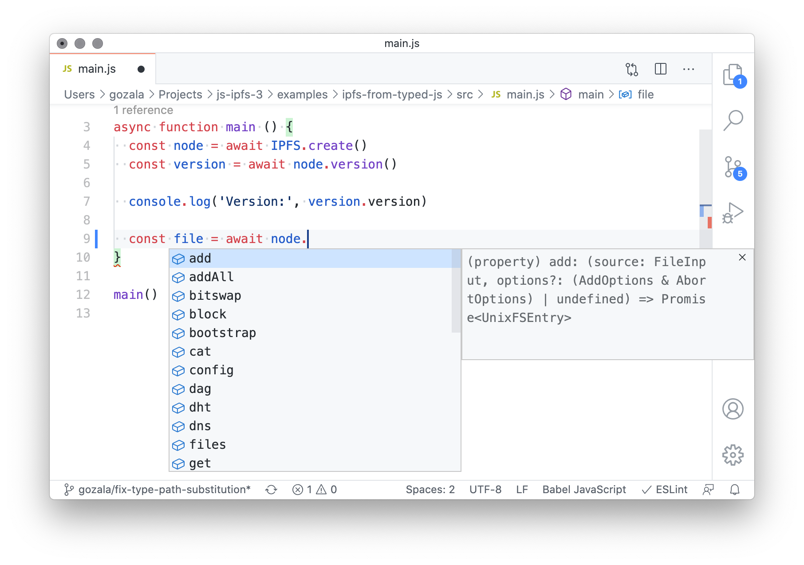

<p align="center">
  <a href="https://js.ipfs.io" title="JS IPFS">
    
  </a>
</p>

<h3 align="center"><b>Using IPFS with typed JS</b></h3>

<p align="center">
  <b><i>Template for setting up a project with JSDoc</i></b>
  <br />
  <br />
  
  <br>
  <a href="https://github.com/ipfs/js-ipfs/tree/master/docs">Explore the docs</a>
  ·
  <a href="https://codesandbox.io/">View Demo</a>
  ·
  <a href="https://github.com/ipfs-examples/js-ipfs-examples/issues">Report Bug</a>
  ·
  <a href="https://github.com/ipfs-examples/js-ipfs-examples/issues">Request Feature/Example</a>
</p>

## Table of Contents

- [Table of Contents](#table-of-contents)
- [About The Project](#about-the-project)
- [Getting Started](#getting-started)
  - [Prerequisites](#prerequisites)
  - [Installation and Running example](#installation-and-running-example)
- [Usage](#usage)
  - [Type checking](#type-checking)
  - [IntelliSense](#intellisense)
  - [Limitations](#limitations)
- [References](#references)
- [Documentation](#documentation)
- [Contributing](#contributing)
- [Want to hack on IPFS?](#want-to-hack-on-ipfs)

## About The Project

- Read the [docs](https://github.com/ipfs/js-ipfs/tree/master/docs)
- Look into other [examples](https://github.com/ipfs-examples/js-ipfs-examples) to learn how to spawn an IPFS node in Node.js and in the Browser
- Consult the [Core API docs](https://github.com/ipfs/js-ipfs/tree/master/docs/core-api) to see what you can do with an IPFS node
- Visit https://dweb-primer.ipfs.io to learn about IPFS and the concepts that underpin it
- Head over to https://proto.school to take interactive tutorials that cover core IPFS APIs
- Check out https://docs.ipfs.io for tips, how-tos and more
- See https://blog.ipfs.io for news and more
- Need help? Please ask 'How do I?' questions on https://discuss.ipfs.io

## Getting Started

### Prerequisites

Make sure you have installed all of the following prerequisites on your development machine:

- Git - [Download & Install Git](https://git-scm.com/downloads). OSX and Linux machines typically have this already installed.
- Node.js - [Download & Install Node.js](https://nodejs.org/en/download/) and the npm package manager.

### Installation and Running example

```console
> npm install
> npm run test
```

Now open your console and check if has errors!

## Usage

This example provides a template for setting up a [JS project that utilizes type checker](https://www.typescriptlang.org/docs/handbook/type-checking-javascript-files.html) and `js-ipfs` type [declarations the were generated from JSDoc comments](https://www.typescriptlang.org/docs/handbook/declaration-files/dts-from-js.html)

Things should work out of the box, only requirement is to disable
[`skipLibCheck`](https://www.typescriptlang.org/tsconfig#skipLibCheck) because type declarations generated by typescript for commonjs modules raise some issues when consumed.

### Type checking

You can type check this example by running following in the example directory:

```
npm test
```

You should see following output:

```
> tsc --noEmit
```

If you remove `// @ts-expect-error` comment is `src/main.js` on line 16 and run `npm test` once again you should see a following output instead:

```
> tsc --noEmit
src/main.js:16:14 - error TS2339: Property 'toUpperCase' does not exist on type 'CID'.

16     file.cid.toUpperCase()
                ~~~~~~~~~~~


Found 1 error.
```

### IntelliSense

In [VSCode](https://code.visualstudio.com/) and other code editors that provide [comparable IntelliSense features](https://docs.microsoft.com/en-us/visualstudio/ide/using-intellisense?view=vs-2019) you should be able to get code auto complete, parameter and return value information for `js-ipfs` APIs.



### Limitations

- Things should work out of the box, with most `tsconfig` settings, however unless
  [`skipLibCheck`](https://www.typescriptlang.org/tsconfig#skipLibCheck) is set to `true` many errors will be reported.

  > That is because
  > types are generated from source JSDoc comments and typescript seems to emit declarations which it then complains about.

- Not all APIs are fully typed so you might observe gaps and `any` types here and there. We hope to improve this over time.

_For more examples, please refer to the [Documentation](#documentation)_

## References

- Documentation:
  - [IPFS CONFIG](https://github.com/ipfs/js-ipfs/blob/master/docs/CONFIG.md)
  - [MISCELLANEOUS](https://github.com/ipfs/js-ipfs/blob/master/docs/core-api/MISCELLANEOUS.md)

## Documentation

- [Config](https://docs.ipfs.io/)
- [Core API](https://github.com/ipfs/js-ipfs/tree/master/docs/core-api)
- [Examples](https://github.com/ipfs-examples/js-ipfs-examples)
- [Development](https://github.com/ipfs/js-ipfs/blob/master/docs/DEVELOPMENT.md)
- [Tutorials](https://proto.school)

## Contributing

Contributions are what make the open source community such an amazing place to be learn, inspire, and create. Any contributions you make are **greatly appreciated**.

1. Fork the IPFS Project
2. Create your Feature Branch (`git checkout -b feature/amazing-feature`)
3. Commit your Changes (`git commit -a -m 'feat: add some amazing feature'`)
4. Push to the Branch (`git push origin feature/amazing-feature`)
5. Open a Pull Request

## Want to hack on IPFS?

[](https://github.com/ipfs/community/blob/master/CONTRIBUTING.md)

The IPFS implementation in JavaScript needs your help! There are a few things you can do right now to help out:

Read the [Code of Conduct](https://github.com/ipfs/community/blob/master/code-of-conduct.md) and [JavaScript Contributing Guidelines](https://github.com/ipfs/community/blob/master/CONTRIBUTING_JS.md).

- **Check out existing issues** The [issue list](https://github.com/ipfs/js-ipfs/issues) has many that are marked as ['help wanted'](https://github.com/ipfs/js-ipfs/issues?q=is%3Aissue+is%3Aopen+sort%3Aupdated-desc+label%3A%22help+wanted%22) or ['difficulty:easy'](https://github.com/ipfs/js-ipfs/issues?q=is%3Aissue+is%3Aopen+sort%3Aupdated-desc+label%3Adifficulty%3Aeasy) which make great starting points for development, many of which can be tackled with no prior IPFS knowledge
- **Look at the [IPFS Roadmap](https://github.com/ipfs/roadmap)** This are the high priority items being worked on right now
- **Perform code reviews** More eyes will help
  a. speed the project along
  b. ensure quality, and
  c. reduce possible future bugs.
- **Add tests**. There can never be enough tests.
- **Join the [Weekly Core Implementations Call](https://github.com/ipfs/team-mgmt/issues/992)** it's where everyone discusses what's going on with IPFS and what's next
